# 02 — Database ERD (SQL Server)

## 1. Quy ước chung

| Quy ước | Chi tiết |
|---------|----------|
| Khoá chính | `Id uniqueidentifier` — Guid v7 sinh ở ứng dụng |
| Audit cột | `CreatedAt, CreatedBy, UpdatedAt, UpdatedBy` (datetimeoffset, uniqueidentifier null) — điền tự động bởi `AuditableEntityInterceptor` |
| Soft delete | `IsDeleted bit, DeletedAt, DeletedBy` — global query filter `!IsDeleted`; Restore đặt lại `IsDeleted=0` |
| Trạng thái nội dung | `Status` (`DRAFT, SCHEDULED, PUBLISHED, UNPUBLISHED, ARCHIVED`) + `PublishAt`, `PublishedAt`. Nội dung public khi `Status=PUBLISHED` **hoặc** `Status=SCHEDULED AND PublishAt <= now` (không phụ thuộc job chạy đúng giờ) |
| Concurrency | `RowVersion rowversion` trên các bảng nội dung → trả 409 khi 2 người sửa cùng lúc |
| Enum | Lưu dạng `nvarchar` (chuỗi), không lưu số → đọc DB dễ, thêm giá trị không vỡ dữ liệu |
| Danh sách enum | EF Core primitive collection → JSON array trong `nvarchar(max)`, truy vấn qua `OPENJSON` (vd: `ContentTypes`, `ProjectRoles`) |
| Slug | `nvarchar(200)` unique filtered index `WHERE IsDeleted = 0` |
| SortOrder | `int` cho mọi thứ có thể kéo thả sắp xếp |
| JSON | `nvarchar(max)` + `ISJSON` check constraint cho block data/settings |
| Tên bảng | Số nhiều, PascalCase như liệt kê trong yêu cầu |

Các bảng có đủ bộ cột chuẩn (`Id, CreatedAt, CreatedBy, UpdatedAt, UpdatedBy, DeletedAt, DeletedBy, IsDeleted, Status`) được đánh dấu **[C]** (Content). Bảng chỉ có audit, không có Status: **[A]**. Bảng nối/không audit: **[J]**.

## 2. ERD tổng quan

```mermaid
erDiagram
    Users ||--o{ UserRoles : has
    Roles ||--o{ UserRoles : has
    Roles ||--o{ RolePermissions : grants
    Permissions ||--o{ RolePermissions : in
    Users ||--o{ RefreshTokens : owns

    Pages ||--o{ PageSections : contains
    PageSections ||--o{ PageBlocks : contains
    Menus ||--o{ MenuItems : contains
    MenuItems ||--o{ MenuItems : children

    Clients ||--o{ Projects : "client of"
    Industries ||--o{ Projects : "industry of"
    Products ||--o{ Projects : "case studies of"
    Projects ||--o{ ProjectCategoryMappings : ""
    ProjectCategories ||--o{ ProjectCategoryMappings : ""
    Projects ||--o{ ProjectTechnologyMappings : ""
    Technologies ||--o{ ProjectTechnologyMappings : ""
    Projects ||--o{ ProjectFeatures : ""
    Projects ||--o{ ProjectMedia : ""
    Projects ||--o{ ProjectMetrics : ""
    Projects ||--o{ ProjectLinks : ""
    MediaFiles ||--o{ ProjectMedia : ""

    ProductCategories ||--o{ Products : ""
    Products ||--o{ ProductFeatures : ""
    Products ||--o{ ProductModules : ""
    Products ||--o{ ProductMedia : ""
    Products ||--o{ ProductPlans : ""
    Products ||--o{ ProductFaqs : ""

    ServiceCategories ||--o{ Services : ""
    Services ||--o{ ServiceFeatures : ""

    Authors ||--o{ Posts : writes
    Posts ||--o{ PostCategoryMappings : ""
    PostCategories ||--o{ PostCategoryMappings : ""
    Posts ||--o{ PostTags : ""
    Tags ||--o{ PostTags : ""

    MediaFolders ||--o{ MediaFolders : children
    MediaFolders ||--o{ MediaFiles : contains
    MediaFiles ||--o{ MediaUsages : "used by"

    Leads ||--o{ LeadActivities : ""
    Leads ||--o{ DemoRequests : ""
    Leads ||--o{ QuoteRequests : ""
    Leads ||--o{ ContactMessages : ""
    Users ||--o{ Leads : "assigned"
```

## 3. Chi tiết bảng

### 3.1 Identity & bảo mật

| Bảng | Loại | Cột chính |
|------|------|-----------|
| `Users` | [A] | Identity (UserName, Email, PasswordHash, SecurityStamp, LockoutEnd, AccessFailedCount, TwoFactorEnabled…) + `FullName, AvatarMediaId, IsActive, LastLoginAt, IsDeleted…` |
| `Roles` | [A] | Identity (Name, NormalizedName) + `Description, IsSystem` (role hệ thống không xoá được) |
| `UserRoles` | [J] | `UserId, RoleId` |
| `Permissions` | [J] | `Code` (PK, vd `project.create`), `Module, Action, Description` — seed từ code, không sửa tay |
| `RolePermissions` | [J] | `RoleId, PermissionCode` |
| `RefreshTokens` | — | `Id, UserId, TokenHash (SHA-256), FamilyId, ExpiresAt, CreatedAt, CreatedByIp, UserAgent, RevokedAt, RevokedReason, ReplacedByTokenId` |

### 3.2 Website & cấu hình

| Bảng | Loại | Cột chính |
|------|------|-----------|
| `SiteSettings` | [A] | `Key` (unique, vd `brand`, `contact`, `social`, `tracking`, `seo.defaults`, `theme`), `Group, ValueJson, IsPublic` — mỗi nhóm là 1 JSON có schema typed ở Application |
| `Menus` | [A] | `Code` (`header`, `footer-company`, `footer-legal`…), `Name, Locale` |
| `MenuItems` | [A] | `MenuId, ParentId, Label, Url \| (LinkType + LinkEntityId), Target, Icon, IsMegaMenu, MegaMenuSource (PRODUCTS/SERVICES/SOLUTIONS), Description, SortOrder, IsEnabled` |
| `Ctas` | [C] | `Code, Title, Description, PrimaryLabel, PrimaryUrl, SecondaryLabel, SecondaryUrl, Variant` — tái sử dụng trong block CTA |

### 3.3 Page builder

| Bảng | Loại | Cột chính |
|------|------|-----------|
| `Pages` | [C] | `Title, Path` (unique, vd `/`, `/gioi-thieu`, `/giai-phap/nha-hang`), `PageType` (HOME/STANDARD/LANDING/SOLUTION/LEGAL), `IndustryId?, Template, PublishAt, RowVersion` |
| `PageSections` | [A] | `PageId, Name, SortOrder, IsEnabled, SettingsJson` (background, padding, width, alignment, theme dark/light, responsive visibility, animation, customClass, anchorId) |
| `PageBlocks` | [A] | `SectionId, Type` (HERO, HEADING, TEXT, RICH_TEXT, IMAGE, VIDEO, GALLERY, STATS, LOGO_CLOUD, FEATURE_GRID, PROJECTS, PRODUCTS, SERVICES, TESTIMONIALS, TEAM, TIMELINE, FAQ, CTA, CONTACT_FORM, PRICING, COMPARISON, BLOG, CUSTOM_HTML, SPACER, DIVIDER), `DataJson, SettingsJson, SortOrder, IsEnabled, ColSpan` |

Block "động" (PROJECTS, PRODUCTS, SERVICES, BLOG, TESTIMONIALS…) chỉ lưu **truy vấn** (`{ "source":"featured", "limit":6, "contentTypes":["CUSTOM_PROJECT"] }`) — dữ liệu được API resolve lúc render, không copy dữ liệu vào block.

### 3.4 Danh mục dùng chung

| Bảng | Loại | Cột chính |
|------|------|-----------|
| `Clients` | [C] | `Name, Slug, LogoMediaId, WebsiteUrl, IndustryId, Description, IsPublic` |
| `Industries` | [C] | `Name, Slug, Icon, Description, SortOrder` |
| `Technologies` | [C] | `Name, Slug, Group` (BACKEND/FRONTEND/MOBILE/DATA/INFRASTRUCTURE/OTHER), `LogoMediaId, Description, Proficiency, ShowOnTechPage, SortOrder` |
| `Testimonials` | [C] | `AuthorName, AuthorTitle, Company, AvatarMediaId, Quote, Rating?, ProjectId?, ProductId?, CanPublish, SortOrder` |
| `Partners` | [C] | `Name, LogoMediaId, Url, Kind, SortOrder` |
| `TeamMembers` | [C] | `FullName, Title, PhotoMediaId, Bio, Links(JSON), SortOrder` |
| `Faqs` | [C] | `Question, Answer, Scope` (GLOBAL/SERVICE/SOLUTION/PRODUCT), `ScopeId?, SortOrder` |

### 3.5 Dự án (Projects)

`Projects` [C]

| Nhóm | Cột |
|------|-----|
| Định danh | `Name, Slug, ShortDescription, Description` (rich text), `ShortResult` (1 câu cho card) |
| Quan hệ | `ClientId?, IndustryId?, ProductId?` (nếu là case study triển khai sản phẩm của NB) |
| Phân loại | `PrimaryContentType` (dùng nhóm/hiển thị badge), `ContentTypes` (JSON array — CUSTOM_PROJECT, OWN_PRODUCT, COMMERCIAL_PRODUCT, INTERNAL_PRODUCT, PARTNER_SOLUTION, CASE_STUDY, WEBSITE, MOBILE_APP, SAAS, ENTERPRISE_SOFTWARE, ECOMMERCE, POS, PMS, ERP, HRM, OTHER), `CommercialType` (FOR_SALE, CUSTOM_DEVELOPMENT, LICENSE, SAAS_SUBSCRIPTION, IMPLEMENTATION_SERVICE, INTERNAL_ONLY, SHOWCASE_ONLY, CONTACT_FOR_PRICE), `ProjectRoles` (JSON array — OWNER, DEVELOPER, CO_DEVELOPER, TECHNICAL_PARTNER, IMPLEMENTATION_PARTNER, OUTSOURCING, MAINTENANCE, UI_UX, BACKEND, FRONTEND, MOBILE, FULLSTACK, OTHER) |
| Sở hữu / credit | `OwnershipType` (NGUYEN_BINH_OWNED, CLIENT_OWNED, CO_OWNED, PARTNER_OWNED, UNDISCLOSED), `ProjectOwner` (text), `NguyenBinhContribution` (rich text), `PublicCreditText`, `CanShowClient, CanShowClientLogo, CanShowScreenshots, CanShowMetrics, CanShowTechnology, CanShowLiveUrl` |
| Case study | `Overview, Problem, Requirements, Solution, Architecture, Challenge, ChallengeSolution, Result` (rich text, mỗi mục để trống thì section không render), `ArchitectureMediaId?` |
| Thời gian | `StartDate, EndDate, LaunchDate, Year` (computed hiển thị), `ProjectState` (IN_PROGRESS, LIVE, MAINTENANCE, ENDED) |
| Link | `WebsiteUrl, DemoUrl, AndroidUrl, IosUrl, GithubUrl, QrMediaId?` |
| Ảnh | `CoverMediaId, ThumbnailMediaId` |
| Nổi bật | `IsFeatured, FeaturedOrder, SortOrder` |
| Xuất bản | `Status, PublishAt, PublishedAt, RowVersion` |
| SEO | qua `SeoMetadata` (EntityType=PROJECT) — các trường `SeoTitle/SeoDescription/CanonicalUrl` của yêu cầu được gom vào đây để mọi entity dùng chung 1 cấu trúc |

| Bảng con | Cột |
|----------|-----|
| `ProjectCategories` [C] | `Name, Slug, Description, SortOrder` |
| `ProjectCategoryMappings` [J] | `ProjectId, CategoryId` |
| `ProjectTechnologies` | *Không dùng bảng riêng* — dùng `Technologies` chung; giữ tên `ProjectTechnologyMappings` [J] `ProjectId, TechnologyId, Note, SortOrder` |
| `ProjectFeatures` [A] | `ProjectId, Title, Description, Icon, MediaId?, SortOrder, IsPublic` |
| `ProjectMedia` [A] | `ProjectId, MediaId?, Kind` (COVER, THUMBNAIL, DESKTOP, MOBILE, DASHBOARD, BEFORE, AFTER, VIDEO, YOUTUBE, VIMEO, EXTERNAL_VIDEO, ARCHITECTURE, PDF, CLIENT_LOGO, FEATURE), `ExternalUrl, Caption, Alt, GroupKey` (ghép before/after), `SortOrder, IsPublic` |
| `ProjectMetrics` [A] | `ProjectId, Label, Value, Unit, Description, SortOrder` — chỉ nhập số liệu có thật; ẩn nếu `CanShowMetrics=0` |
| `ProjectLinks` [A] | `ProjectId, Kind` (WEBSITE, APP_STORE, GOOGLE_PLAY, DEMO, DOCS, OTHER), `Label, Url, SortOrder` |

### 3.6 Sản phẩm (Products)

| Bảng | Cột chính |
|------|-----------|
| `Products` [C] | `Name, Slug, Tagline, ShortDescription, Description, CategoryId, ProductType` (POS, PMS, ERP, HRM, SAAS, MOBILE, OTHER), `CommercialType, OwnershipType` (mặc định NGUYEN_BINH_OWNED), `TargetUsers, Problem, Solution, Integration, Deployment, Security` (rich text), `HeroMediaId, LogoMediaId, DemoVideoUrl, DemoUrl, PricingNote, IsFeatured, SortOrder, PublishAt, RowVersion` |
| `ProductCategories` [C] | `Name, Slug, Description, SortOrder` |
| `ProductFeatures` [A] | `ProductId, Title, Description, Icon, MediaId?, Group, SortOrder` |
| `ProductModules` [A] | `ProductId, Name, Description, Icon, MediaId?, Features(JSON string[]), SortOrder` |
| `ProductMedia` [A] | như `ProjectMedia` |
| `ProductPlans` [A] | `ProductId, Name, PriceAmount?, Currency, BillingPeriod` (ONE_TIME, MONTHLY, YEARLY, CONTACT), `PriceNote, Features(JSON), IsHighlighted, CtaLabel, CtaUrl, SortOrder` |
| `ProductFaqs` [A] | `ProductId, Question, Answer, SortOrder` |

### 3.7 Dịch vụ

| Bảng | Cột chính |
|------|-----------|
| `Services` [C] | `Name, Slug, CategoryId, Icon, ShortDescription, Description, Deliverables, ProcessJson, TechnologyIds(JSON), RelatedProjectIds(JSON), CoverMediaId, IsFeatured, SortOrder, PublishAt, RowVersion` |
| `ServiceCategories` [C] | `Name, Slug, Description, SortOrder` |
| `ServiceFeatures` [A] | `ServiceId, Title, Description, Icon, SortOrder` |

### 3.8 Blog

| Bảng | Cột chính |
|------|-----------|
| `Posts` [C] | `Title, Slug, Excerpt, ContentHtml` (sanitize khi lưu), `ContentJson` (editor state), `CoverMediaId, AuthorId, ReadingMinutes, IsFeatured, PublishAt, PublishedAt, ViewCount, RowVersion` |
| `PostCategories` [C] | `Name, Slug, Description, ParentId?, SortOrder` |
| `PostCategoryMappings` [J] | `PostId, CategoryId, IsPrimary` |
| `Tags` [A] | `Name, Slug` |
| `PostTags` [J] | `PostId, TagId` |
| `Authors` [C] | `Name, Slug, Title, Bio, AvatarMediaId, UserId?, Links(JSON)` |

Ràng buộc: slug của `Posts` và `PostCategories` **không được trùng nhau** (cùng không gian `/blog/{slug}`) — kiểm tra ở Application.

### 3.9 Media

| Bảng | Cột chính |
|------|-----------|
| `MediaFolders` [A] | `Name, ParentId?, Path` (materialized, vd `/projects/perfectkey`) |
| `MediaFiles` [A] | `FolderId?, FileName, OriginalName, StorageKey, Url, MimeType, Extension, Kind` (IMAGE, VIDEO, DOCUMENT, OTHER), `SizeBytes, Width, Height, DurationSec, Alt, Caption, Title, Tags(JSON), Variants(JSON: [{format:'webp',width:640,key,size}]), BlurDataUrl, Checksum (SHA-256, phát hiện trùng), IsPrivate` (file đính kèm lead) |
| `MediaUsages` [J] | `MediaId, EntityType, EntityId, Field` — cập nhật mỗi lần lưu entity; dùng cho "đang được sử dụng ở…" và cảnh báo khi xoá |

### 3.10 Marketing / CRM mini

| Bảng | Cột chính |
|------|-----------|
| `Leads` [A] | `FullName, Company, Email, Phone, Source` (CONTACT_FORM, QUOTE_FORM, DEMO_FORM, NEWSLETTER, PHONE, ZALO, MANUAL…), `ProjectType, Budget, Timeline, Message, PipelineStatus` (NEW, CONTACTED, QUALIFIED, PROPOSAL, NEGOTIATION, WON, LOST, SPAM), `AssignedUserId?, LandingUrl, Referrer, UtmSource, UtmMedium, UtmCampaign, UtmContent, UtmTerm, IpAddress, UserAgent, LastActivityAt, EstimatedValue?, LostReason` |
| `LeadActivities` [A] | `LeadId, Type` (NOTE, STATUS_CHANGE, ASSIGN, CALL, EMAIL, MEETING, SUBMISSION), `Content, OldValue, NewValue, CreatedBy` |
| `LeadAttachments` [J] | `LeadId, MediaId` (file private, chỉ tải qua API có quyền `lead.view`) |
| `QuoteRequests` [A] | `LeadId, ProjectType, Budget, Timeline, Description, ServiceId?, ProductId?, Status` |
| `DemoRequests` [A] | `LeadId, ProductId?, PreferredDate, PreferredTime, CompanySize, Note, Status` (NEW, SCHEDULED, DONE, CANCELLED), `ScheduledAt` |
| `ContactMessages` [A] | `LeadId, Subject, Message, IsRead` |
| `Newsletters` [A] | `Email (unique), Status` (SUBSCRIBED, UNSUBSCRIBED), `Source, ConfirmedAt, UnsubscribeToken` |

Mọi submission tạo/ghép một `Lead` (khớp theo Email hoặc Phone trong 30 ngày) + 1 `LeadActivity(SUBMISSION)` → pipeline thống nhất, vẫn giữ bảng chi tiết riêng theo yêu cầu.

### 3.11 SEO

| Bảng | Cột chính |
|------|-----------|
| `SeoMetadata` [A] | `EntityType` (PAGE, PRODUCT, SERVICE, PROJECT, POST, POST_CATEGORY, PROJECT_CATEGORY, …, ROUTE), `EntityId?, RoutePath?` (cho route tĩnh như `/du-an`), `Locale, Title, Description, CanonicalUrl, OgTitle, OgDescription, OgImageMediaId, TwitterImageMediaId, Robots` (index,follow…), `SchemaType, SchemaJson` (ghi đè), `Keywords, ExcludeFromSitemap, SitemapPriority, SitemapChangeFreq`. Unique `(EntityType, EntityId, Locale)` |
| `SeoRedirects` [A] | `OldPath` (unique, chuẩn hoá lowercase, không trailing slash), `NewPath`, `StatusCode` (301/302/410), `IsActive, HitCount, LastHitAt, Note, IsAutoGenerated` (tự tạo khi đổi slug) |
| `BrokenLinks` [J] | `Path, Referrer, HitCount, FirstSeenAt, LastSeenAt, IsResolved` — ghi nhận từ 404 của web |

### 3.12 Hệ thống

| Bảng | Cột chính |
|------|-----------|
| `AuditLogs` | `Id, UserId, UserName, Action` (CREATE, UPDATE, DELETE, RESTORE, PUBLISH, UNPUBLISH, LOGIN, LOGIN_FAILED, PERMISSION_CHANGE…), `EntityType, EntityId, OldValues(JSON), NewValues(JSON), ChangedColumns, IpAddress, UserAgent, CorrelationId, CreatedAt` — ghi tự động bởi `AuditSaveChangesInterceptor` |
| `SystemLogs` | Serilog MSSqlServer sink: `Timestamp, Level, Message, Exception, Properties(JSON), CorrelationId` (chỉ Warning+) |
| `ContentVersions` | `Id, EntityType, EntityId, Version, SnapshotJson, IsAutosave, Note, CreatedBy, CreatedAt` — snapshot đầy đủ aggregate (vd Page kèm sections/blocks); restore = deserialize + lưu như 1 update mới |
| `ContentTranslations` | `EntityType, EntityId, Locale, Field, Value` — unique `(EntityType, EntityId, Locale, Field)`; chuẩn bị `en` |
| `PreviewTokens` | `TokenHash, EntityType, EntityId, ExpiresAt, CreatedBy` — xem trước bản nháp trên web public |

## 4. Index quan trọng

- `Projects(Status, IsFeatured, FeaturedOrder)`, `Projects(IndustryId)`, `Projects(Slug)` unique filtered.
- `Posts(Status, PublishAt DESC)`, `Posts(AuthorId)`.
- `Leads(PipelineStatus, CreatedAt DESC)`, `Leads(Email)`, `Leads(AssignedUserId)`.
- `SeoRedirects(OldPath)` unique, `SeoMetadata(EntityType, EntityId, Locale)` unique, `SeoMetadata(RoutePath)`.
- `MediaUsages(MediaId)`, `MediaUsages(EntityType, EntityId)`.
- `AuditLogs(EntityType, EntityId, CreatedAt DESC)`, `AuditLogs(UserId, CreatedAt DESC)`.
- Full-text index (Phase 4) trên `Projects(Name, ShortDescription)`, `Products`, `Services`, `Posts(Title, Excerpt, ContentHtml)` cho `/search`; fallback `LIKE` khi chưa bật full-text.

## 5. Seed khởi tạo

- Permissions (từ code), 6 role hệ thống + ma trận quyền, 1 SuperAdmin (email/mật khẩu lấy từ biến môi trường `Seed__AdminEmail`, `Seed__AdminPassword` — không hardcode).
- SiteSettings mặc định (brand "Nguyên Bình Technology", màu, contact rỗng).
- Industries, Technologies, ServiceCategories cơ bản.
- 9 dự án (mục 7, 59) — chỉ có thông tin được cung cấp (tên, URL, loại, vai trò). **Không bịa** số liệu, khách hàng, kết quả. `OwnershipType=CLIENT_OWNED` cho dự án theo yêu cầu, `UNDISCLOSED` cho Cơm Thị Nở (chờ cấu hình), `NGUYEN_BINH_OWNED` chỉ cho POS Nguyên Bình. Trạng thái `DRAFT` — admin bổ sung nội dung và quyền công bố rồi mới Publish.
- Product "POS Nguyên Bình" (`/san-pham/pos-nguyen-binh`), Page Home với các section mặc định trỏ tới block động.
